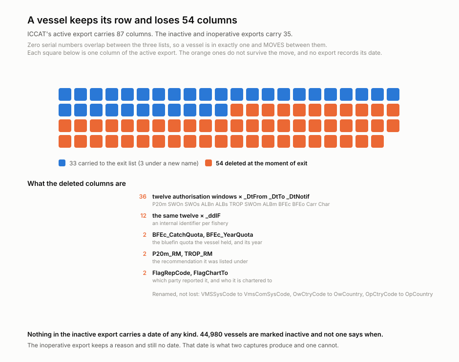
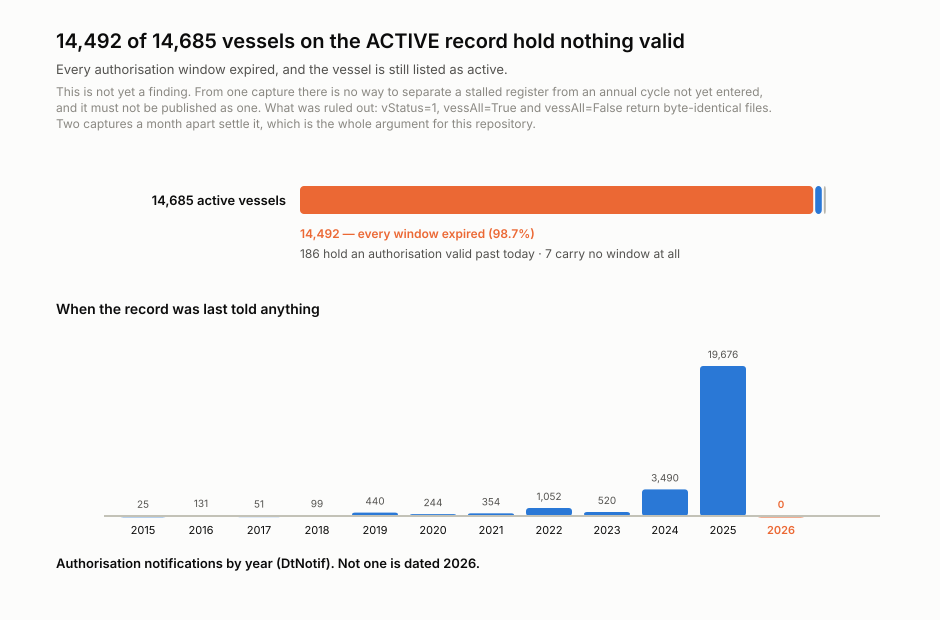
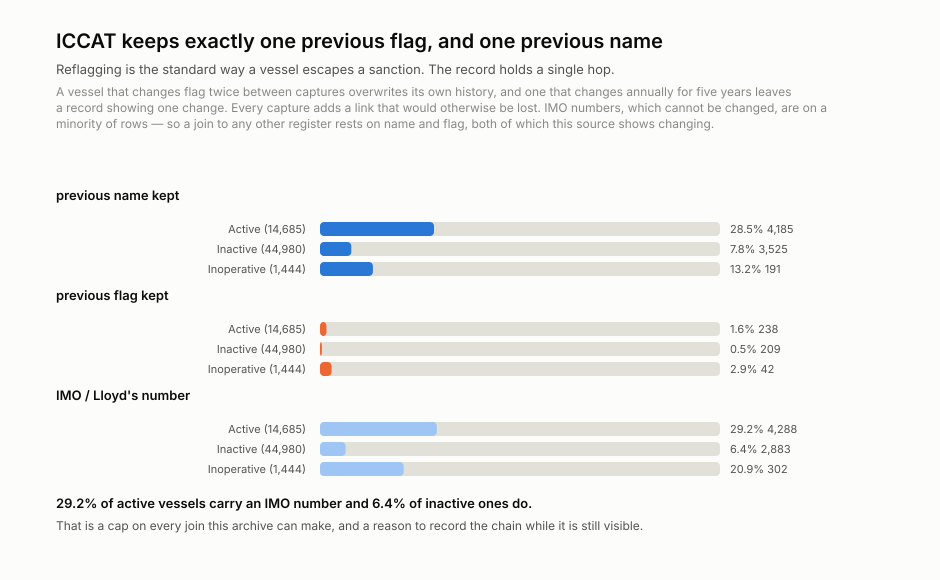
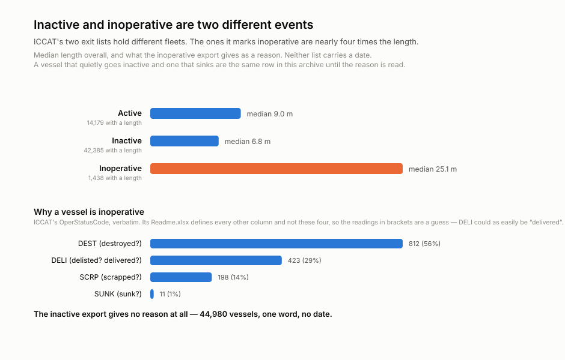
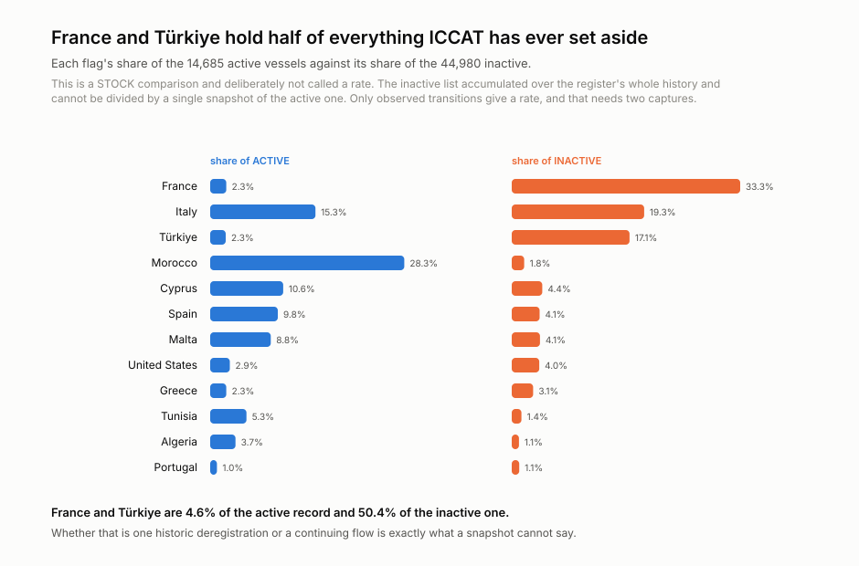

<h1 align="center">wss-fishing-authorisations</h1>

<p align="center">
  <strong>Who may fish tuna in the Atlantic, and the 54 columns deleted the moment they stop</strong>
</p>

<div align="center">

  <a href="https://github.com/q3dresearch/wss-fishing-authorisations/actions/workflows/capture-monthly.yml"></a>
  <a href="https://github.com/q3dresearch/wss-fishing-authorisations/commits"></a>
  <a href="https://github.com/q3dresearch/wss-fishing-authorisations/blob/main/LICENSE"></a>
  <a href="https://github.com/q3dresearch/wss-fishing-authorisations"></a>

</div>

<p align="center">
  <sub>fleet: <a href="https://github.com/q3dresearch/wss-engine">engine</a> · <a href="https://github.com/q3dresearch/wss-protected-areas">protected areas</a> · <a href="https://github.com/q3dresearch/wss-food-trace">food trace</a> · <a href="https://github.com/q3dresearch/wss-forest-harvest">forest harvest</a> · <strong>fishing authorisations</strong></sub>
</p>

**ICCAT does not delete the vessel. It deletes fifty-four columns about it, and
never records when.**

<p align="center">
  
</p>

That is a subtler destruction than the usual case, and it is exactly why nobody
has noticed: the row survives. ICCAT publishes the same fleet in three exports
with **zero serial-number overlap** — a vessel is in exactly one and *moves*:

| | rows | columns |
| --- | --- | --- |
| **Active** (`vStatus=1`) | 14,685 | **87** |
| **Inactive** (`vStatus=2`) | 44,980 | **35** |
| **Inoperative** (`vStatus=3`) | 1,444 | 35 |

Diffing the three headers rather than eyeballing them: 57 columns are on the
active export and not on the exit exports, three of those are *renames*
(`VMSSysCode` to `VmsComSysCode`, `OwCtryCode` to `OwCountry`, `OpCtryCode` to
`OpCountry`), and 54 are genuinely deleted.

**And the transition has no date anywhere.** 44,980 vessels are marked
`inactive` and not one says when. So the date a vessel stopped being authorised
to fish tuna in the Atlantic exists nowhere, and only two captures produce it.

## The number that needs a second capture before anyone repeats it

<p align="center">
  
</p>

Of the 14,685 vessels ICCAT lists as **active**, **14,492 hold only expired
authorisation windows.** 186 hold one valid past today; 7 carry none at all.
25,033 of the 26,081 windows (96%) have expired, and **nothing in the file is
dated 2026** — `DtNotif` runs 2015 to 2025, peaks at 19,676 in 2025, and stops.

**This is not yet a finding and is not published as one.** From a single
capture there is no way to separate a stalled register from an annual cycle not
yet entered. What *was* ruled out: `vStatus=1`, `vessAll=True&vStatus=1` and
`vessAll=False&vStatus=1` return byte-identical 4,380,450-byte files with the
same 14,685 rows, so `vessAll` is ignored and there is no hidden date filter.
`Last-Modified` equals the request time, because the export is generated per
request, and says nothing about freshness.

Two captures a month apart settle it. That is the whole argument for this
repository, and it is written down rather than dressed up.

## Reflagging, and the chain that gets overwritten

<p align="center">
  
</p>

Changing flag is the standard way a vessel escapes a sanction, and ICCAT keeps
exactly **one** previous value. A vessel that hops twice between captures
overwrites its own history; one that hops annually for five years leaves a
record showing a single change. Every capture adds a link that would otherwise
be lost.

The ceiling on all of it: **an IMO number is on 29.2% of active vessels and
6.4% of inactive ones.** Without it, a join to any other register rests on name
and flag — both of which this source shows changing.

## Two exit lists, two different events

<p align="center">
  
</p>

The vessels ICCAT marks *inoperative* have a median length of **25.1 m**
against **6.8 m** for the ones that merely go *inactive*. Those are two
different fleets and two different events, and only one of them carries a
reason: `destroyed` 812, `delisted` 423, `scrapped` 198, `sunk` 11. The
inactive export gives 44,980 vessels one word and no date.

## Where the fleet went — a stock comparison, deliberately not a rate

<p align="center">
  
</p>

**France and Türkiye are 4.6% of the active record and 50.4% of the inactive
one.** That is a stock comparison and is not called a rate here: the inactive
list accumulated over the register's entire history and cannot be divided by a
single snapshot of the active one. Whether it is one historic deregistration or
a continuing flow is exactly what a snapshot cannot say and two captures can.

## Two defects in the source, found by parsing it

Both would have silently produced clean, plausible, wrong output.

**The export is cp1252, not UTF-8.** It raises on byte `0xdc`, and decoding
with `errors="replace"` quietly turns Türkiye into `T�rkiye` and mangles
`ACUÑA`, `AIMÉ`, `SALAIÑO` and `ABDÜLHAMID` across thousands of vessel and
owner names. The parser tries UTF-8 strictly first, so a future switch is
noticed rather than mangled, and falls back to cp1252.

**ICCAT misspells its own header.** The inoperative export writes `Op--Name`
where the others write `OpName`. **436 of its 1,444 rows carry an operator**,
and a parser reading only `OpName` finds zero of them.

A third, less consequential: `LOAm` reaches **2,445 m** on the active record.
499 active rows and 2,575 inactive ones fall outside 1–500 m and are recorded
as `length_invalid` rather than dropped — a defect that is silently discarded
looks like clean data to everyone downstream.

The questions this archive exists to answer, with honest statuses and the
people who act on them, are in
[docs/research-questions.md](docs/research-questions.md).

## Personal data: raw is complete, published is not

`OwName`, `OpName` and their addresses are filled on 48.4% of active rows and
29.9% of inactive ones. Most are companies — `Rozafa shpk`, `INTERA COMPANY
SA` — and plenty are plainly individuals: `HARROLL WEAVER`, `J GREER`, `SHAWN
TRUESDALE`.

Raw goes to object storage **complete**, because the record cuts both ways: a
vessel owner disputing an enforcement action has no way to evidence what the
register said in 2025 once ICCAT overwrites it.

What is **published** is an **unsalted** one-way fingerprint for every owner and
operator, plus the name in clear only where a corporate token matches. The
error is made in the safe direction on purpose: a misclassified individual
stays hidden, and a misclassified company merely goes unnamed. The lack of a
salt is deliberate and follows `wss-healthcare-exclusions` — ICCAT's own public
export already names every owner currently on the record, so a secret would
guard nothing while risking an archive that cannot join to its own history if
the secret is lost.

## Coverage

| source | what it is | cadence | first capture |
| --- | --- | --- | --- |
| `iccat.vessels.record` | the ICCAT Record of Vessels, all three exports — 61,109 vessels across active, inactive and inoperative | monthly | 2026-09 |

## The data you get

`derived/observations/<YYYY-MM>.csv.gz` — one row per entity, per metric, per
capture:

```
series_id, entity_id, observed_at, captured_at, metric, value, unit, source_id, raw_ref, parser_version
```

| entity | metrics |
| --- | --- |
| `vessel:<ICCATSerialNo>` | `listed` (active / inactive / inoperative — **the observation**), `name`, `flag`, `flag_previous`, `name_previous`, `imo`, `vessel_type`, `length_m` or `length_invalid`, `vms_system`, `owner_country`, `operator_country`, `owner_fp`, `operator_fp`, `owner`/`operator` (companies only), and on active only `flag_reporting`, `flag_chartered_to`, `quota_bluefin`, `authorisation_lapsed`; on inoperative only `inoperative_reason` |
| `authorisation:<serial>:<fishery>` | `valid_from`, `valid_to`, `notified_at` — twelve fisheries, a closed set from the source's own schema |
| `flag:<code>` | `vessels_active`, `vessels_inactive`, `vessels_inoperative` |
| `vesseltype:<ISSCFV>` | the same three |
| `reason:<reason>` | `vessels_listed` |
| `feed:iccat:<list>` | `vessels_listed`, `rows_listed`, `columns`, `flags_listed`, `renamed_listed`, `reflagged_listed`, `with_imo`, `length_invalid`, `length_missing`, and on active `windows_listed`, `windows_expired`, `windows_live`, `vessels_all_expired`, `vessels_authorised`, `vessels_no_window`, `quota_vessels`, `quota_bluefin_total` |

**Fisheries are a sub-entity, not a metric suffix.** Twelve authorisation
windows × three dates would be 36 metric names, and a vocabulary that wide
stops being a vocabulary.

**`quota_bluefin` is in kilograms.** The median is 40,000 and the fleet total
25,022,393, which is the bluefin TAC in kg. Labelling it tonnes would inflate
it a thousandfold.

## Storage

`storage: object`, because `personal_data: present` requires it — the engine
refuses any other combination, and it is right to. The first capture wrote
4,380,450 + 6,673,620 + 252,050 bytes to R2; the derived table is 546,495
observations at 2.8 MB a month.

## Adding a source

1. Add `registry/<source_id>.yml` (copy the existing entry), `status: paused`.
2. Add a parser in `parsers/` if the payload shape is new.
3. `wss doctor <source_id>` — **read the raw response**.
4. Flip to `status: active`, add a Coverage row, commit.

Nothing else. No workflow edits, ever.

## Run it locally

```bash
python -m venv .venv && . .venv/bin/activate
pip install -r requirements.txt
export WSS_CONTACT="https://github.com/q3dresearch/wss-fishing-authorisations"

wss validate
wss doctor iccat.vessels.record
wss capture --cadence monthly       # needs the R2 variables from .env.example
wss derive --parsers parsers.iccat_vessel_v1
python examples/visualize.py
```

`raw/` is empty on purpose: `storage: object` puts the three exports in R2
(11.3 MB for the first capture) and only the manifest, the derived table and
the charts live in git.

## Going live

1. Push this repo **and the engine repo** under the same GitHub owner
   (`q3dresearch`) — the workflows install the engine from
   `github.com/q3dresearch/wss-engine` at the pinned tag.
2. Set the repo secret **`WSS_CONTACT`** — capture refuses to run without it.
3. Set **`R2_ACCOUNT_ID`**, **`R2_ACCESS_KEY_ID`**, **`R2_SECRET_ACCESS_KEY`**,
   **`R2_BUCKET_NAME`** and optionally **`WSS_OBJECT_PREFIX`**. Without them the
   capture job runs and writes nothing.
4. Run `capture-monthly` once by hand, confirm the bot's data commit lands,
   then let the cron take over.

## Licences

Two separate files, on purpose: code is MIT ([LICENSE](LICENSE)); the derived
observations are CC-BY-4.0 ([LICENSE-DATA](LICENSE-DATA)), citation in
[CITATION.cff](CITATION.cff). Captured content remains subject to ICCAT's own
terms.

> ICCAT, *Record of Vessels 20 metres in length overall or greater authorized
> to operate in the Convention area* (Rec. 25-12), and the associated TROP,
> SWO-MED and Carrier records. www.iccat.int

Topics: `git-scraping` · `open-data` · `point-in-time-data` · `fisheries` · `iuu-fishing` · `rfmo`
